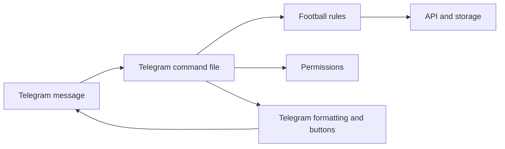
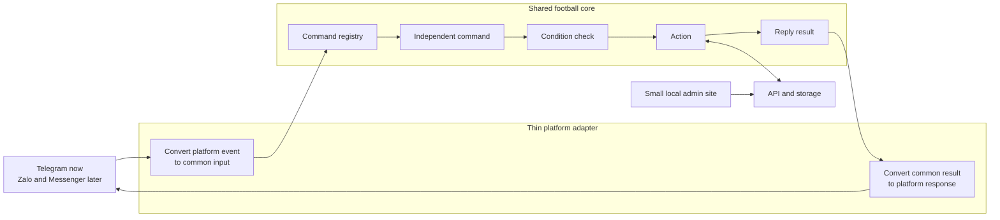
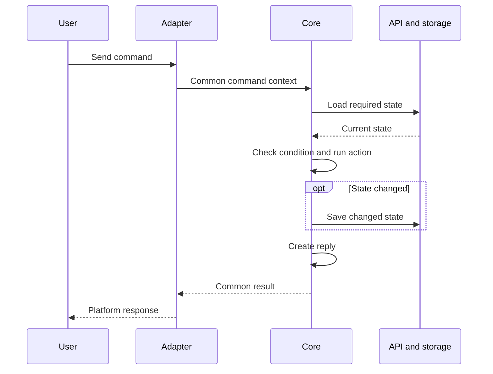

# Multi-Platform Bot Refactor Plan

Status: In progress — command catalog approved

## Goal

Make the football features reusable across Telegram, Zalo, Messenger, and
future bot platforms.

The first version must stay small:

- Keep the current Telegram bot working.
- Use one shared football core.
- Use thin platform adapters.
- Provide a small local admin site.
- Let one installation manage one football community.

## Non-Goals

The first version will not include:

- An OpenClaw-style plugin marketplace.
- Dynamic plugin loading.
- Multiple communities in one installation.
- Full feature parity across every platform.
- A complete rewrite of the API or database.
- Bot tokens stored in browser storage or the bot-state JSON mirror.

## Main Principles

1. Refactor in small steps. Do not rewrite all commands at once.
2. Keep Telegram as the first working adapter.
3. Core code must not import the Telegram client or Telegram message types.
4. Adapters only translate platform input and output.
5. The API remains the only writer for persistent bot state.
6. Platform-only features must have a fallback, such as plain text.
7. Add a second platform only after the independent command model works on
   Telegram.

## Current and Target Design

### Current Design



Football rules and Telegram behavior are currently mixed inside command files.

### Target Design



## Independent Command Request Model

Commands do not form a required sequence. Every command is an independent
request that reads the current state and handles its own conditions.

Examples:

- `/bench` can run before `/addme` and return an empty or current bench.
- `/team` can run before `/chiateam` and explain that no team exists.
- `/addme` can be followed by any other command.
- `/chiateam` checks its own player requirements when it is called.

Every command keeps four parts:

1. **Instruction**: Name, aliases, arguments, help text, and permission.
2. **Condition**: Validate the actor, input, and current state.
3. **Action**: Read or change football state.
4. **Reply**: Return a platform-neutral result.

The common runtime handles one request at a time:

1. A platform receives a message or button action.
2. Its adapter creates a common command context.
3. The registry finds the independent command.
4. The command loads only the state it needs.
5. The command checks its condition.
6. The command runs its action.
7. The command saves state only when it changed.
8. The command creates its reply result.
9. The adapter renders and sends the reply.



There is no workflow engine and no required command order. A multi-step button
or poll interaction may keep temporary interaction state, but it still belongs
to one command.

## Minimal Core Contracts

These contracts are examples. Their final fields can change during the first
independent command refactor.

### Command Definition

```js
{
  name: 'bench',
  aliases: [],
  instruction: {
    usage: '/bench',
    description: 'Show the current bench',
    permission: 'player'
  },
  condition(context, state),
  action(context, state),
  reply(outcome)
}
```

Each command owns these four parts. The shared runtime only calls them in the
same way.

### Command Context

```js
{
  command: 'addme',
  args: [],
  actor: {
    platform: 'telegram',
    externalId: '123',
    displayName: 'Nghia',
    username: 'nghia'
  },
  conversation: {
    externalId: 'group-456',
    threadId: null
  }
}
```

The core can use `platform` for identity lookup, but it must not read a raw
Telegram, Zalo, or Messenger event.

### Command Result

```js
{
  messages: [
    {
      text: 'Nghia joined the bench.',
      actions: [{ id: 'view_bench', label: 'View bench' }],
    },
  ];
}
```

An adapter may render `actions` as buttons. If the platform does not support
buttons, it may return a text command instead.

A message may also include a small platform-neutral follow-up input:

```js
{
  input: {
    command: 'editbench',
    args: ['2']
  }
}
```

The adapter may use this to route the actor's next text message back to the
same command. The temporary input state stays in the adapter and expires; the
core does not store raw platform events.

### Platform Adapter

```js
{
  (start(),
    stop(),
    toCommandContext(platformEvent),
    sendResult(context, result),
    capabilities);
}
```

Optional capabilities can include:

- Buttons
- Message editing
- Native polls
- Threads or topics
- Images and files

The core must not assume that every capability exists.

## Shared and Platform-Specific Responsibilities

| Shared football core            | Platform adapter        |
| ------------------------------- | ----------------------- |
| Bench rules                     | Raw event parsing       |
| Player and team rules           | Platform authentication |
| Team shuffling                  | Message sending         |
| Team constraints                | Markdown conversion     |
| Venue and fee calculations      | Buttons and callbacks   |
| Match creation                  | Native polls            |
| Leaderboard updates             | Threads or topics       |
| Role-based permission decisions | Webhook verification    |
| Storage interfaces              | Platform error handling |

## Target Folder Structure

This is the target structure. Files should move into it gradually.

```text
core/
  contracts/
    command-context.js
    command-result.js
  commands/
    command-router.js
  use-cases/
    bench/
    teams/
    management/
    players/
    matches/
    leaderboard/
  ports/
    state-repository.js
    player-repository.js
    permission-policy.js

platforms/
  telegram/
    client.js
    adapter.js
    formatter.js
    interactions.js
  zalo/
  messenger/

runtime/
  start-bot.js

api/
  routes/
  services/
  public/
    admin/
```

## Migration Phases

### Phase 0: Protect Current Behavior

Effort: Small

- [x] List the commands that are active in `bot/index.js`.
- [x] Add missing tests for the first command refactor.
- [x] Record expected Telegram messages and state changes.
- [x] Keep the current PostgreSQL and JSON mirror behavior unchanged.
- [x] Confirm all current tests pass before refactoring.

Exit criteria:

- The current Telegram behavior has enough tests to detect regressions.
- There is no database or storage migration in this phase.

### Phase 1: Audit and Redesign Commands

Effort: Medium

Do this before extracting the shared core. We should not migrate commands that
are unused, duplicated, unclear, or too difficult to use.

Create `docs/COMMAND_CATALOG.md` as the command decision record. For every
command and alias, record:

| Field               | Purpose                                                      |
| ------------------- | ------------------------------------------------------------ |
| Command and aliases | Show every way the command can be called                     |
| Runtime status      | Confirm whether `bot/index.js` registers it                  |
| User                | Player, admin, or system                                     |
| Purpose             | Describe the user problem it solves                          |
| Inputs              | Text arguments, buttons, replies, or polls                   |
| State changes       | Show what data it reads and writes                           |
| Current output      | Text, buttons, poll, or message edit                         |
| Usage evidence      | Logs, team feedback, or unknown                              |
| Current problems    | Confusing name, duplicate purpose, weak result, or dead code |
| Platform dependency | Telegram-only behavior that needs a fallback                 |
| Decision            | Keep, merge, rewrite, deprecate, or remove                   |

Current command information is spread across:

- `bot/index.js`
- `bot/commands/index.js`
- `bot/commands/command-registry.js`
- The `/start` help message
- `README.md`
- Command handler files that may not be registered

For example, AI and standalone leaderboard handler files exist, but the active
runtime does not register all of them. The audit must find every mismatch like
this before the architecture migration.

#### Command Decisions

Use only these decisions:

- **Keep**: The command is useful and its current behavior is clear.
- **Merge**: Another command solves the same user problem.
- **Rewrite**: The feature is useful, but its name, inputs, or output are weak.
- **Deprecate**: Keep it temporarily and direct users to its replacement.
- **Remove**: It is dead, unsafe, or has no supported use case.

#### Audit and Refactor Tasks

- [x] Find all registered and unregistered command handlers.
- [x] List aliases and overlapping commands.
- [x] Review command usage logs when available.
- [x] Ask the current team about commands with no clear usage evidence.
- [x] Map each command to one clear user need.
- [x] Mark every command as keep, merge, rewrite, deprecate, or remove.
- [x] Define the final command name, arguments, permission, and response.
- [x] Define a plain-text fallback for every interactive command.
- [x] Create one command manifest for active command metadata.
- [x] Generate command filtering and help text from that manifest where safe.
- [x] Make the runtime, registry, help message, and README agree.
- [x] Add deprecation messages before removing commands used by real users.
- [x] Remove dead commands from active registration after catalog approval.

Do not fully rewrite football rules in this phase. Define the correct command
behavior first, then implement it once through the shared core. This prevents
refactoring the same command twice.

Exit criteria:

- Every command file and alias is recorded in the command catalog.
- Every command has an approved decision.
- There is one supported command list.
- Unused commands are excluded from the core migration.
- The first commands selected for refactoring have clear specifications.

### Phase 2: Create the Independent Command Runtime

Effort: Medium

- [x] Add the common command context.
- [x] Add the common command result.
- [x] Add the command definition contract.
- [x] Add a small command registry and runner.
- [x] Run each command through instruction, condition, action, and reply.
- [x] Add a state repository interface around the current API client.
- [x] Add a Telegram adapter around the current Telegram client.
- [x] Keep old commands working during the migration.

Exit criteria:

- Core contracts do not import `telegram-client.js`.
- The runtime does not require one command to run before another command.
- Old and new command styles can run at the same time.

### Phase 3: Prove the Pattern with One Command

Effort: Medium

Choose one retained command from the approved command catalog. Prefer a command
that is used often and has clear behavior. Do not connect it to another command.

- [x] Move its instruction into the command definition.
- [x] Extract its conditions from Telegram handling.
- [x] Extract its action into platform-neutral core code.
- [x] Return its reply as a common command result.
- [x] Keep its Telegram behavior compatible with the current bot.
- [x] Test the command directly from every relevant starting state.
- [x] Test Telegram input and output translation separately.
- [x] Confirm unrelated earlier commands do not affect it.

Exit criteria:

- The selected command works on Telegram.
- Its condition, action, and reply can run without Telegram.
- It works without a required previous command.
- The shared contracts feel small and clear.

Decision point:

- If the contracts are too large, simplify them before migrating more commands.
- Do not continue until this command is stable.

Current result: the contracts remain small, all automated `/bench` core,
repository, and Telegram adapter tests pass, and the live Telegram smoke test
passed on 2026-08-03. Phase 4 may continue.

The first state-changing migration, `/addme`, passed its live Telegram test on
2026-08-04. Its API save also synchronizes the legacy in-memory maps during the
transition.

The admin-only `/add` migration passed its live Telegram checkpoint on
2026-08-05.

The `/editbench` button, follow-up text, and API persistence flow passed its
live Telegram checkpoint on 2026-08-05.

### Phase 4: Migrate Remaining Commands

Effort: Large

Refactor one command at a time. The groups below are only for planning; they do
not define runtime order:

1. Bench editing and clearing.
2. Team editing, clearing, and constraints.
3. Venue, fees, and payment calculations.
4. Players and registration.
5. Matches and leaderboard.
6. Voting and other platform-heavy interactions.

For every retained command:

- [x] Follow the approved command-catalog decision.
- [x] Merge, rewrite, deprecate, or remove commands before migrating them.
- [x] Refactor each retained command independently.
- [x] Preserve its instruction, condition, action, and reply.
- [x] Extract football rules into its use case.
- [x] Replace raw Telegram identity access with the common actor.
- [x] Return common results from the core.
- [x] Keep platform formatting in the Telegram adapter.
- [x] Test all valid and invalid starting states without command-order assumptions.
- [x] Add core tests and adapter tests.
- [x] Remove the old slash handler after the new handler is stable.

Exit criteria:

- Football use cases do not import the Telegram client.
- Retained commands work as independent requests.
- Telegram remains fully usable.
- Platform-only behavior is isolated in `platforms/telegram/`.

Migration progress:

- [x] `/bench` — read-only bench view.
- [x] `/addme` — actor-based bench join with API persistence and Telegram
      identity compatibility.
- [x] `/add` — admin-only atomic guest batch with stable member identities.
- [x] `/editbench` — admin-only rename by button or numbered text, with
      adapter-owned follow-up input and API persistence.
- [x] `/clearbench` — admin-only atomic selection removal with paginated
      actions; `all` clears the bench directly as approved by the owner.
- [x] `/chiateam` — admin-only atomic two-team or three-team assignment with
      stable identities and manifest constraints.
- [x] `/addtoteam` — admin-only atomic member selection with stable duplicate
      checks, paginated actions, and explicit two-team or three-team targets.
- [x] `/clearteam` — admin-only atomic member removal with paginated actions
      and confirmed whole-stack deletion.
- [x] `/team` — read-only two-team and three-team views.
- [x] `/manifest` — admin-only multi-step or text constraint creation with
      stable identities, contradiction checks, and no bench side effects.
- [x] `/manifests` — read-only constraint list; `/mf` transition alias.
- [x] `/removemanifest` — admin-only atomic numbered or paginated action
      removal with API persistence, stale-button protection, and a plain-text
      fallback.
- [x] `/clearmanifests` — admin-only confirmed atomic clear with API
      persistence and platform-neutral confirm/cancel actions.
- [x] `/san` — persistent venue read for players and atomic replacement writes
      for admins; legacy `/clearsan` uses the same stored value.
- [x] `/clearsan` — admin-only atomic clear of the persistent venue with safe
      empty-state handling.
- [x] `/tiensan` — persistent fee read for players and strict atomic updates
      for admins, with grouped-number support and invalid-input rejection.
- [x] `/tiennuoc` — persistent water-fee read for players and strict atomic
      updates for admins, using the shared money parser.
- [x] `/chiatien` — read-only two-team fee calculation.
- [x] `/winner` — renamed from `/teamthang`; player reads, atomic admin writes,
      and optional two-team fee results now use the shared runtime.
- [x] `/loser` — renamed from `/teamthua`; transition-only guidance maps its
      old input to the correct `/winner` replacement without changing state.
- [x] `/taovote` — platform-neutral creation rules publish Telegram native
      polls through a port, save one active vote atomically, and preserve the
      legacy poll-answer listener during migration.
- [x] `/demvote` — read-only normalized summary supports legacy Telegram poll
      indexes and platform-neutral named choices with rich adapter output.
- [x] `/start` — help is generated from the approved 33-command manifest.
- [x] `/sync` — admin-only atomic attendance sync uses stable actor and guest
      identities while preserving legacy Telegram vote compatibility.
- [x] `/clearvote` — admin-only confirmation closes the platform poll when
      supported and clears persistent vote state atomically.
- [x] `/register` — explicit self, admin add, and admin delete actions use a
      platform-neutral player repository.
- [x] `/me` — actor identity and linked player statistics are read through
      shared player and statistics ports.
- [x] `/players` — ranked, paginated player and statistics list.
- [x] `/player` — detailed statistics lookup by shirt number.
- [x] `/edit-stats` — admin-only named fields replace totals with validation
      and a before/after result.
- [x] `/match` — explicit read and admin-write actions use shared match,
      player, statistics, and optional summary ports; `winner` and `loser`
      update saved-match player totals safely, and only `save` loads next-match
      state.
- [x] `/matches` — bounded recent-match pagination through the match port.
- [x] `/reset` — admin-only immediate atomic reset with best-effort poll close.

Phase 4 result: all 33 approved commands (34 names including `/mf`) now run
through one shared registry. The Telegram poll-answer listener remains as a
platform event; no legacy slash handler is initialized. The Phase 4 automated
checkpoint passes 360 tests.

### Phase 5: Integrate the Existing Admin Site

Effort: Small to Medium

Decision:

- [x] Reuse the existing `chiateam-admin` site instead of creating another
      admin site inside the API.
- [x] Keep the admin site and API as separate processes.
- [x] Continue using the server-side admin proxy and internal API token.

Owner checkpoint:

- [x] The owner approved reuse of the existing admin site on 2026-09-01.
- [ ] Notify the owner before creating any new runtime-settings UI.

Phase 4 compatibility work:

- [x] Add `san`, `manifest`, and the expanded `activeVote` contract to the
      admin bot-storage types.
- [x] Preserve external string or numeric user IDs and unknown player or vote
      metadata during storage round trips.
- [x] Merge admin edits into the latest complete bot storage before calling the
      full-replacement `POST /api/bot-storage` endpoint.
- [x] Preserve Phase 4 storage fields during viewer-only player renames.
- [x] Accept `winner_side` in match responses while omitting it from match
      create and update payloads.
- [x] Keep `/winner`, `/loser`, and immediate `/reset` command references
      compatible with the migrated bot.

Verification:

- [x] Admin compatibility tests pass: 9 of 9.
- [x] Admin TypeScript check passes.
- [x] Admin production build passes on 2026-09-01.
- [x] Live admin storage round-trip test passed on 2026-09-01.

Deferred until the owner explicitly approves new settings UI:

- Runtime status and maintenance controls.
- Enabled platform and allowed conversation settings.
- Admin-user management and a dedicated runtime-settings store.
- A combined command for starting the API and bot. Local development currently
  keeps them in separate terminal shells.

Exit criteria:

- [x] Existing admin workflows continue to work with Phase 4 API responses.
- [x] Saving next-match data does not erase unrelated bot storage fields.
- [x] The live storage round-trip test passes.

Phase 5 result: complete. The existing admin site is compatible with the Phase 4
API, and no new runtime-settings UI was created.

### Phase 6: Prove a Second Adapter

Effort: Medium to Large

Choose either Zalo or Messenger. Do not build both together.

Decision:

- [x] Zalo was selected as the second adapter on 2026-09-01.
- [x] Start with a separate local polling process so the existing Telegram bot
      and API processes do not change.
- [x] Use Zalo as an announcement-first player adapter. Do not expose admin or
      roster/team mutation commands in this checkpoint.
- [x] Use a text poll because the current Zalo Bot API does not provide a native
      poll-send method.
- [ ] Connect the production webhook only after the owner passes the live Zalo
      command checkpoint.
- [x] The owner chose a dedicated Vercel webhook before starting Messenger.
- [x] Keep Messenger deferred until the Zalo webhook is deployed and tested.

Restricted command set:

```text
/start
/poll
/vote 0|1|2|3|4
/demvote
/bench
/team
```

`/vote` is the only Zalo command in this checkpoint that changes state. It
writes a platform-qualified voter into the active vote shared with Telegram.
All admin commands, including `/chiateam`, are not registered on Zalo.

- [x] Confirm the platform's current API and account requirements.
- [x] Add webhook secret verification and in-process message ID idempotency.
- [x] Add PostgreSQL-backed message claims for serverless idempotency.
- [x] Add authenticated API routes for claim, completion, and release.
- [x] Add an isolated Vercel Node.js function without polling startup.
- [x] Translate Zalo text events into the common context.
- [x] Translate common results into Zalo text and Markdown messages.
- [x] Add text fallbacks for missing buttons, polls, and topics.
- [x] Add adapter contract tests.

Current checkpoint:

- [x] A standalone yarn dev:zalo polling process is available.
- [x] The adapter registers only /start, /poll, /vote, /demvote, /bench, and
      /team.
- [x] `/addme`, `/chiateam`, and every other admin or mutation command are
      hidden and unhandled on Zalo.
- [x] The six commands use shared use cases and the existing API state
      repository.
- [x] Mixed Telegram and Zalo votes keep separate platform identities and can
      still be synchronized to the bench by Telegram admin flow.
- [x] Automated restricted-command checkpoint passes: 26 of 26.
- [x] Webhook and event-lifecycle checkpoint passes: 28 of 28.
- [x] Full repository regression suite passes: 413 of 413.
- [x] Historical live test: create/configure the Zalo bot and pass `/start`,
      `/addme`, and `/bench` before the announcement-first restriction.
- [ ] Owner live test: `/start` lists only the six restricted commands.
- [ ] Owner live test: `/poll`, `/vote`, and `/demvote` share the active vote
      with Telegram.
- [ ] Owner live test: `/bench` and `/team` remain read-only.
- [ ] Owner live test: `/addme` and `/chiateam` cause no response or state
      change.
- [x] Add the production webhook function and deployment configuration.
- [ ] Deploy the API claim routes and the Vercel webhook.
- [ ] Register the stable production HTTPS webhook with Zalo.
- [ ] Stop the local Zalo polling shell after registration succeeds.

Exit criteria:

- [x] Telegram and Zalo use the same football use cases.
- [x] No Zalo checks are added inside core use cases.
- [x] Zalo exposes no admin commands in its registry or `/start` help.
- [ ] The owner passes the live restricted-command test on Zalo.

### Phase 7: Prepare the Open-Source Release

Effort: Medium

- [ ] Add a root `LICENSE` file.
- [ ] Add `CONTRIBUTING.md`.
- [ ] Add `SECURITY.md`.
- [ ] Review Git history and tracked files for secrets.
- [ ] Complete `.env.example` with safe values and comments.
- [ ] Add a one-command local setup.
- [ ] Add database initialization and migration instructions.
- [ ] Add adapter development documentation.
- [ ] Add a troubleshooting section.
- [ ] Add a release checklist and versioning policy.

Exit criteria:

- A new developer can clone, configure, and run the project from the README.
- No production secret or private data is included.
- The supported platform and feature limits are clear.

## Identity Plan

Do not change the player database during the first independent command
refactor.

During the Telegram-only phases:

- Keep the current Telegram `user_id` behavior behind an identity interface.
- Convert external platform IDs to strings in core contexts.

Before adding a second adapter, add a separate identity table similar to:

```text
player_identities
  player_id
  platform
  external_user_id
  username
```

This lets one football player link more than one platform account.

Multi-community or tenant storage is not required for the first release. One
installation represents one community. Add tenant support only when there is a
real requirement.

## Platform Capability Fallbacks

| Feature         | Preferred behavior          | Fallback                          |
| --------------- | --------------------------- | --------------------------------- |
| Inline buttons  | Render platform buttons     | Send numbered text choices        |
| Message editing | Update the existing message | Send a new message                |
| Native polls    | Use the platform poll       | Use text voting or the admin site |
| Telegram topics | Send to the selected topic  | Send to the main conversation     |
| Markdown        | Use supported rich text     | Send plain text                   |

## Testing Strategy

### Core Tests

- Test football rules with plain JavaScript objects.
- Do not mock Telegram in core tests.
- Verify state changes and common results.

### Adapter Tests

- Verify raw platform events become the correct command context.
- Verify common results become the correct platform messages.
- Verify capability fallbacks.

### Regression Tests

- Keep current Telegram tests while each command group is migrated.
- Test persistent state through the API.
- Test PostgreSQL as primary storage and JSON as the mirror.

## Main Risks

| Risk                                        | Impact | Control                                                     |
| ------------------------------------------- | ------ | ----------------------------------------------------------- |
| Telegram behavior changes during refactor   | High   | Migrate one command at a time and keep regression tests     |
| Core contracts become too generic           | High   | Validate them with one independent command before expanding |
| Buttons and polls differ by platform        | Medium | Use capabilities and text fallbacks                         |
| Player identities conflict across platforms | High   | Add a separate identity table before adapter two            |
| Admin site exposes secrets                  | High   | Localhost default, real auth, and env-based secrets         |
| Admin and bot overwrite state               | High   | Keep the API as the only writer and add safe update checks  |
| Scope grows into an OpenClaw-like system    | High   | Follow the non-goals and release one adapter at a time      |

## First Milestone Definition of Done

The first milestone is complete when:

- [x] One retained command uses the independent command runtime.
- [x] Its instruction, condition, action, and reply are clearly separated.
- [x] Its core tests run without Telegram.
- [x] Tests cover its valid, invalid, and empty starting states.
- [x] It does not require another command to run first.
- [x] Its Telegram input and output are handled through an adapter.
- [x] Persistent storage behavior has not changed.
- [x] The design is still understandable from one architecture diagram.

## Final Release Definition of Done

The first open-source multi-platform release is complete when:

- [ ] All active Telegram football commands use the shared core.
- [ ] One second platform supports the minimum command set.
- [ ] The local admin site manages safe runtime settings.
- [ ] One command starts the local application.
- [ ] Setup, security, contribution, and adapter documentation exist.
- [ ] A clean installation passes tests and starts without private project data.

## Recommended First Action

Start with Phase 0 and Phase 1. Approve the command catalog before creating the
independent command runtime in Phase 2. Then select one retained command for
Phase 3 and refactor it without linking it to another command.

Do not migrate commands marked for removal. Do not build the admin site or a
second adapter until the independent command pattern is useful and simple.
