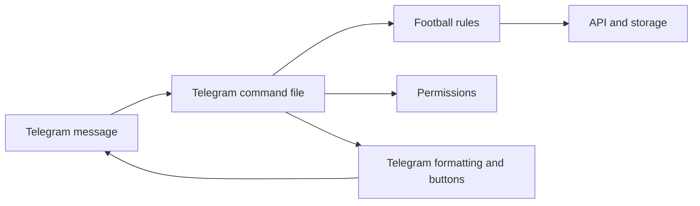
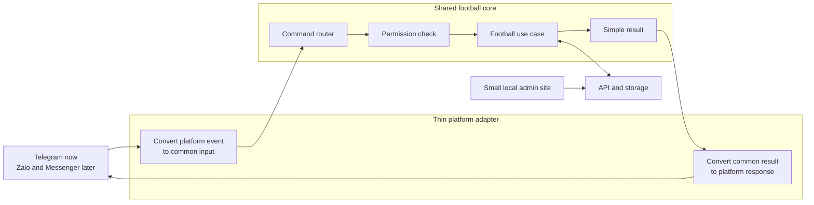
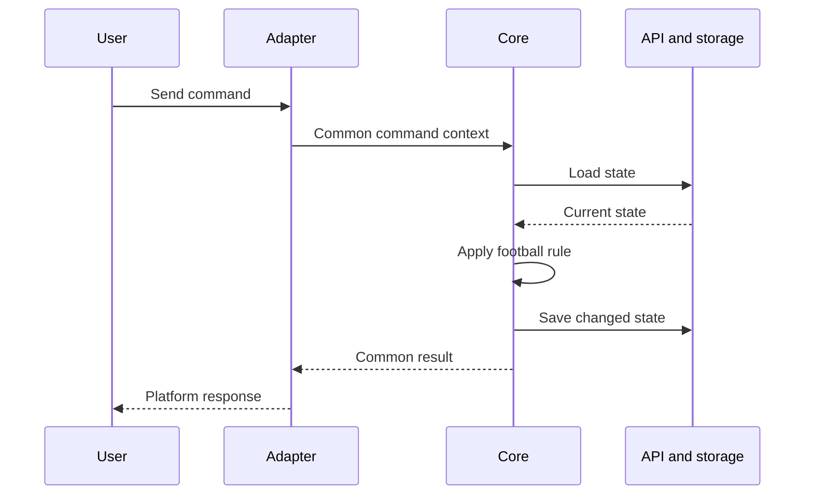

# Multi-Platform Bot Refactor Plan

Status: Proposal

## Goal

Make the football features reusable across Telegram, Zalo, Messenger, and
future bot platforms.

The first version must stay small:

- Keep the current Telegram bot working.
- Use one shared football core.
- Use thin platform adapters.
- Provide a small local admin site.
- Let one installation manage one football community.

## Non-Goals

The first version will not include:

- An OpenClaw-style plugin marketplace.
- Dynamic plugin loading.
- Multiple communities in one installation.
- Full feature parity across every platform.
- A complete rewrite of the API or database.
- Bot tokens stored in browser storage or the bot-state JSON mirror.

## Main Principles

1. Refactor in small steps. Do not rewrite all commands at once.
2. Keep Telegram as the first working adapter.
3. Core code must not import the Telegram client or Telegram message types.
4. Adapters only translate platform input and output.
5. The API remains the only writer for persistent bot state.
6. Platform-only features must have a fallback, such as plain text.
7. Add a second platform only after the shared flow works on Telegram.

## Current and Target Design

### Current Design



Football rules and Telegram behavior are currently mixed inside command files.

### Target Design



## Shared Core Flow

Every supported command should follow the same flow:

1. A platform receives a message or button action.
2. Its adapter creates a common command context.
3. The command router selects a football use case.
4. The core checks permissions.
5. The use case loads the required state.
6. The use case applies football rules.
7. The use case saves state when needed.
8. The core returns a simple result.
9. The adapter renders and sends that result.



## Minimal Core Contracts

These contracts are examples. Their final fields can change during the first
vertical slice.

### Command Context

```js
{
  command: 'addme',
  args: [],
  actor: {
    platform: 'telegram',
    externalId: '123',
    displayName: 'Nghia',
    username: 'nghia'
  },
  conversation: {
    externalId: 'group-456',
    threadId: null
  }
}
```

The core can use `platform` for identity lookup, but it must not read a raw
Telegram, Zalo, or Messenger event.

### Command Result

```js
{
  messages: [
    {
      text: 'Nghia joined the bench.',
      actions: [
        { id: 'view_bench', label: 'View bench' }
      ]
    }
  ]
}
```

An adapter may render `actions` as buttons. If the platform does not support
buttons, it may return a text command instead.

### Platform Adapter

```js
{
  start(),
  stop(),
  toCommandContext(platformEvent),
  sendResult(context, result),
  capabilities
}
```

Optional capabilities can include:

- Buttons
- Message editing
- Native polls
- Threads or topics
- Images and files

The core must not assume that every capability exists.

## Shared and Platform-Specific Responsibilities

| Shared football core | Platform adapter |
| --- | --- |
| Bench rules | Raw event parsing |
| Player and team rules | Platform authentication |
| Team shuffling | Message sending |
| Team constraints | Markdown conversion |
| Venue and fee calculations | Buttons and callbacks |
| Match creation | Native polls |
| Leaderboard updates | Threads or topics |
| Role-based permission decisions | Webhook verification |
| Storage interfaces | Platform error handling |

## Target Folder Structure

This is the target structure. Files should move into it gradually.

```text
core/
  contracts/
    command-context.js
    command-result.js
  commands/
    command-router.js
  use-cases/
    bench/
    teams/
    management/
    players/
    matches/
    leaderboard/
  ports/
    state-repository.js
    player-repository.js
    permission-policy.js

platforms/
  telegram/
    client.js
    adapter.js
    formatter.js
    interactions.js
  zalo/
  messenger/

runtime/
  start-bot.js

api/
  routes/
  services/
  public/
    admin/
```

## Migration Phases

### Phase 0: Protect Current Behavior

Effort: Small

- [ ] List the commands that are active in `bot/index.js`.
- [ ] Add missing tests for the first migration flow.
- [ ] Record expected Telegram messages and state changes.
- [ ] Keep the current PostgreSQL and JSON mirror behavior unchanged.
- [ ] Confirm all current tests pass before refactoring.

Exit criteria:

- The current Telegram behavior has enough tests to detect regressions.
- There is no database or storage migration in this phase.

### Phase 1: Create the Shared Flow

Effort: Medium

- [ ] Add the common command context.
- [ ] Add the common command result.
- [ ] Add a small command runner.
- [ ] Add a state repository interface around the current API client.
- [ ] Add a Telegram adapter around the current Telegram client.
- [ ] Keep old commands working during the migration.

Exit criteria:

- Core contracts do not import `telegram-client.js`.
- Old and new command styles can run at the same time.

### Phase 2: Prove One Vertical Slice

Effort: Medium

Migrate this complete user journey first:

```text
/addme -> /bench -> /chiateam -> /team
```

- [ ] Move bench join rules into a core use case.
- [ ] Move bench viewing into a core use case.
- [ ] Move team creation and shuffle rules into core use cases.
- [ ] Move team viewing into a core use case.
- [ ] Keep Telegram text compatible with the current bot.
- [ ] Test the use cases without mocking Telegram.
- [ ] Run Telegram adapter tests for input and output translation.

Exit criteria:

- The full flow works on Telegram.
- Its football rules can run without Telegram.
- The shared contracts feel small and clear.

Decision point:

- If the contracts are too large, simplify them before migrating more commands.
- Do not continue until this slice is stable.

### Phase 3: Migrate Remaining Commands

Effort: Large

Migrate one feature group at a time:

1. Bench editing and clearing.
2. Team editing, clearing, and constraints.
3. Venue, fees, and payment calculations.
4. Players and registration.
5. Matches and leaderboard.
6. Voting and other platform-heavy interactions.

For every feature group:

- [ ] Extract football rules into use cases.
- [ ] Replace raw Telegram identity access with the common actor.
- [ ] Return common results from the core.
- [ ] Keep platform formatting in the Telegram adapter.
- [ ] Add core tests and adapter tests.
- [ ] Remove the old handler only after the new handler is stable.

Exit criteria:

- Football use cases do not import the Telegram client.
- Telegram remains fully usable.
- Platform-only behavior is isolated in `platforms/telegram/`.

### Phase 4: Add the Small Admin Site

Effort: Medium

Serve a small admin site from the existing API, for example at `/admin`.

First version pages:

- [ ] Runtime status.
- [ ] Enabled platform.
- [ ] Allowed chat or conversation.
- [ ] Admin users.
- [ ] Basic football settings.
- [ ] Maintenance mode.

Security rules:

- [ ] Bind to localhost by default for local installations.
- [ ] Require authentication when remote access is enabled.
- [ ] Do not place internal API tokens in frontend source code.
- [ ] Keep platform tokens in environment variables at first.
- [ ] Do not write platform tokens to the bot-state JSON mirror.
- [ ] Persist runtime settings in a dedicated settings store.

Runtime changes:

- [ ] Add one command that starts the API and bot together.
- [ ] Keep Docker services separate internally if that remains easier to operate.
- [ ] Show the admin URL after startup.

Exit criteria:

- A new user can see status and edit safe settings in one place.
- The settings are persistent and used by the runtime.

### Phase 5: Prove a Second Adapter

Effort: Medium to Large

Choose either Zalo or Messenger. Do not build both together.

Start with the minimum command set:

```text
/start
/addme
/bench
/chiateam
/team
```

- [ ] Confirm the platform's current API and account requirements.
- [ ] Add webhook verification and event idempotency when required.
- [ ] Translate platform events into the common context.
- [ ] Translate common results into platform messages.
- [ ] Add text fallbacks for missing buttons, polls, or topics.
- [ ] Add adapter contract tests.

Exit criteria:

- Telegram and the second platform use the same football use cases.
- No second-platform checks are added inside core use cases.

### Phase 6: Prepare the Open-Source Release

Effort: Medium

- [ ] Add a root `LICENSE` file.
- [ ] Add `CONTRIBUTING.md`.
- [ ] Add `SECURITY.md`.
- [ ] Review Git history and tracked files for secrets.
- [ ] Complete `.env.example` with safe values and comments.
- [ ] Add a one-command local setup.
- [ ] Add database initialization and migration instructions.
- [ ] Add adapter development documentation.
- [ ] Add a troubleshooting section.
- [ ] Add a release checklist and versioning policy.

Exit criteria:

- A new developer can clone, configure, and run the project from the README.
- No production secret or private data is included.
- The supported platform and feature limits are clear.

## Identity Plan

Do not change the player database during the first vertical slice.

During the Telegram-only phases:

- Keep the current Telegram `user_id` behavior behind an identity interface.
- Convert external platform IDs to strings in core contexts.

Before adding a second adapter, add a separate identity table similar to:

```text
player_identities
  player_id
  platform
  external_user_id
  username
```

This lets one football player link more than one platform account.

Multi-community or tenant storage is not required for the first release. One
installation represents one community. Add tenant support only when there is a
real requirement.

## Platform Capability Fallbacks

| Feature | Preferred behavior | Fallback |
| --- | --- | --- |
| Inline buttons | Render platform buttons | Send numbered text choices |
| Message editing | Update the existing message | Send a new message |
| Native polls | Use the platform poll | Use text voting or the admin site |
| Telegram topics | Send to the selected topic | Send to the main conversation |
| Markdown | Use supported rich text | Send plain text |

## Testing Strategy

### Core Tests

- Test football rules with plain JavaScript objects.
- Do not mock Telegram in core tests.
- Verify state changes and common results.

### Adapter Tests

- Verify raw platform events become the correct command context.
- Verify common results become the correct platform messages.
- Verify capability fallbacks.

### Regression Tests

- Keep current Telegram tests while each command group is migrated.
- Test persistent state through the API.
- Test PostgreSQL as primary storage and JSON as the mirror.

## Main Risks

| Risk | Impact | Control |
| --- | --- | --- |
| Telegram behavior changes during refactor | High | Migrate one flow at a time and keep regression tests |
| Core contracts become too generic | High | Validate them with one vertical slice before expanding |
| Buttons and polls differ by platform | Medium | Use capabilities and text fallbacks |
| Player identities conflict across platforms | High | Add a separate identity table before adapter two |
| Admin site exposes secrets | High | Localhost default, real auth, and env-based secrets |
| Admin and bot overwrite state | High | Keep the API as the only writer and add safe update checks |
| Scope grows into an OpenClaw-like system | High | Follow the non-goals and release one adapter at a time |

## First Milestone Definition of Done

The first milestone is complete when:

- [ ] Telegram still supports `/addme`, `/bench`, `/chiateam`, and `/team`.
- [ ] These commands use shared football use cases.
- [ ] Their core tests run without Telegram.
- [ ] Telegram input and output are handled through an adapter.
- [ ] Persistent storage behavior has not changed.
- [ ] The design is still understandable from one architecture diagram.

## Final Release Definition of Done

The first open-source multi-platform release is complete when:

- [ ] All active Telegram football commands use the shared core.
- [ ] One second platform supports the minimum command set.
- [ ] The local admin site manages safe runtime settings.
- [ ] One command starts the local application.
- [ ] Setup, security, contribution, and adapter documentation exist.
- [ ] A clean installation passes tests and starts without private project data.

## Recommended First Action

Start only Phase 0 and Phase 1, then migrate the first vertical slice:

```text
/addme -> /bench -> /chiateam -> /team
```

Do not build the admin site or a second adapter until this flow proves that the
shared core is useful and simple.
